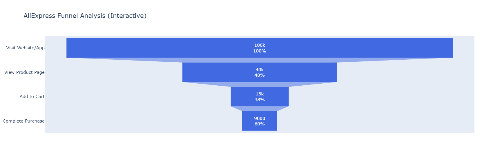

# AliExpress Funnel Analysis 📊

This project is a simulated funnel analysis for **AliExpress**, built as part of a Data Analyst course.

## 🧠 What's Inside
- Simulated user behavior across key funnel steps
- Step-by-step **conversion** and **drop-off** rate calculations
- Visualizations using **Matplotlib** and **Plotly**
- Key business insights and improvement recommendations

## 🧰 Tools Used
- Python: `pandas`, `matplotlib`, `plotly`
- Jupyter Notebook

## 📊 Preview

Below is a visual funnel chart showing user flow through the platform:

## 📁 File Included
- `AliExpressFunnelAnalysis.ipynb` — the main Jupyter Notebook with full analysis
